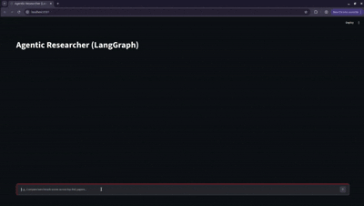
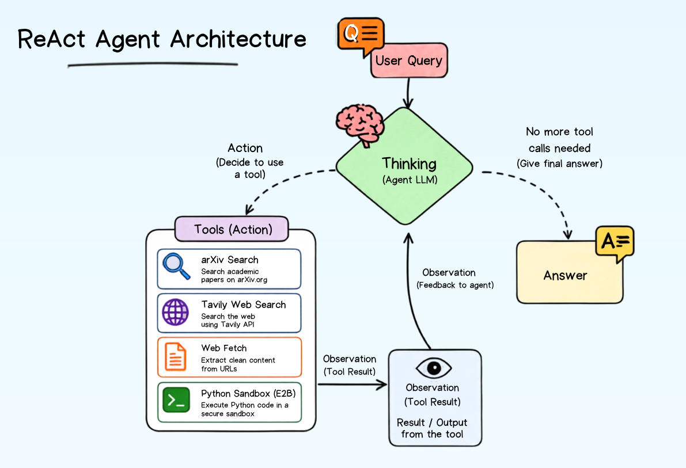

<div align="center">

# 🧠 Agentic Research Assistant

**An autonomous research agent that discovers, reads, computes, and reports — powered by LLM tool-calling.**

[](https://www.python.org/)
[](https://streamlit.io/)
[](https://www.langchain.com/langgraph)
[](https://openrouter.ai/)
[](LICENSE)



</div>

---

## 📖 Overview

**Agentic Research Assistant** is an LLM-powered agent that autonomously researches a topic end-to-end. Given a natural-language question, it searches academic and web sources, reads the most relevant ones in full, runs computations on the data it finds, and synthesizes everything into a single, well-cited markdown report — all through a transparent, step-by-step Streamlit UI.

The agent follows a strict **four-phase research protocol** (Discover → Read → Compute → Report), enforced via the system prompt and tool budgets, so it behaves predictably instead of looping indefinitely or fabricating sources.

The repository ships **two parallel implementations** of the same agent so you can compare orchestration styles:

| Implementation | Orchestration | Entry point |
|---|---|---|
| **Manual tool-calling loop** | Raw OpenAI-compatible SDK loop with custom step/budget tracking | `legacy/agent.py` + `legacy/app.py` |
| **Graph-based agent** | [LangGraph](https://www.langchain.com/langgraph) `StateGraph` with a `ToolNode` | `agent_graph.py` + `app_graph.py` |

> Built as part of a walkthrough video by **YantraCode** — [watch it here](#)

---

## ✨ Features

- 🔍 **Multi-source discovery** — searches [arXiv](https://arxiv.org/) for papers and [Tavily](https://tavily.com/) for general web/news context
- 📄 **Full-text reading** — fetches and cleans article/paper text via `trafilatura`, with automatic token-aware truncation
- 🧮 **Sandboxed computation** — runs Python in an isolated [E2B](https://e2b.dev/) sandbox to compute stats, comparisons, or tables from extracted data
- 🧭 **Phase-gated reasoning** — the agent cannot re-enter an earlier research phase once it moves forward, preventing wasted or repeated tool calls
- 💰 **Tool-call budgeting** — per-tool call limits and step limits prevent runaway loops and control cost
- 🔁 **Duplicate-call detection** — identical tool calls are automatically short-circuited
- 🖥️ **Live agent trace UI** — every "thinking" step, tool call, and tool result streams into the Streamlit interface in real time
- 🧩 **Two interchangeable architectures** — a minimal manual loop and a LangGraph-based graph, sharing the same tools and system prompt

---

## 🏗️ Architecture

<p align="center">
  
</p>

---

## 🛠️ Tech Stack

| Layer | Technology |
|---|---|
| LLM access | OpenAI SDK / OpenRouter |
| Agent orchestration | Custom loop, LangGraph |
| UI | Streamlit |
| Web search | Tavily API |
| Academic search | arXiv API |
| Web scraping | trafilatura |
| Code execution | E2B Code Interpreter (sandboxed) |
| Tokenization | tiktoken |

---

## 📁 Project Structure

```
.
├── legacy/
│   ├── agent.py            # Manual tool-calling loop (OpenAI SDK style)
│   └── app.py               # Streamlit UI for the manual loop agent
├── tools/
│   ├── __init__.py          # Tool registry (AVAILABLE_TOOLS)
│   ├── arxiv_tool.py         # arXiv search tool
│   ├── search_tool.py        # Tavily web search tool
│   ├── web_fetch.py           # Article/page scraping + truncation
│   └── sandbox_tool.py        # E2B sandboxed Python execution
├── assets/
│   ├── Architecture.png         
│   ├── research_agent.gif
├── agent_graph.py            # LangGraph StateGraph agent
├── app_graph.py               # Streamlit UI for the LangGraph agent
├── tools_langchain.py          # LangChain @tool wrappers around tools/
├── prompts.py                  # Shared system prompt + tool schema generation
├── config.py                    # Environment/config loading
├── requirements.txt
├── .gitignore
├── LICENSE
├── .env.example
└── README.md
```

---

## 🚀 Getting Started

### Prerequisites
- Python 3.10+
- API keys for:
  - [OpenRouter](https://openrouter.ai/) (LLM access)
  - [Tavily](https://tavily.com/) (web search)
  - [E2B](https://e2b.dev/) (sandboxed code execution)

### Installation

```bash
# Clone the repository
git clone https://github.com/<your-org>/<repo-name>.git
cd <repo-name>

# Create and activate a virtual environment
python -m venv venv
source venv/bin/activate      # Windows: venv\Scripts\activate

# Install dependencies
pip install -r requirements.txt
```

### Configuration

Create a `.env` file in the project root:

```env
OPENROUTER_API_KEY=your_openrouter_key_here
TAVILY_API_KEY=your_tavily_key_here
E2B_API_KEY=your_e2b_key_here
```

> The model used by default is configured in `config.py` via `MODEL_NAME` — update it to any model available on your OpenRouter account.

### Running the app

**Manual tool-calling agent:**
```bash
streamlit run legacy/app.py
```

**LangGraph-based agent:**
```bash
streamlit run app_graph.py
```

Then open the local URL Streamlit prints (typically `http://localhost:8501`) and ask a research question, e.g.:

> *"Compare recent agentic RAG benchmarks and summarize which approach performs best."*

---

## 🧭 How the Agent Reasons

The system prompt (`prompts.py`) constrains the agent to move forward through four phases only, never backward:

1. **Discover** — run 2–3 targeted `arxiv_search` / `tavily_search` queries to shortlist candidate sources.
2. **Read** — fetch full text for only the 1–2 most relevant sources via `web_fetch`.
3. **Compute** *(optional)* — use `python_sandbox` to derive metrics or build comparison tables.
4. **Report** — produce a final markdown report with direct answers, attributed claims, and explicit caveats about limited/mixed evidence. No further tool calls are allowed.

Tool budgets and step limits (`tool_budgets`, `max_steps` in `agent.py`; `TOOL_BUDGET`, `MAX_STEPS` in `agent_graph.py`) guarantee the agent always converges to a final answer.

---

## 🗺️ Roadmap

- [ ] Add citation-linked footnotes in the final report
- [ ] Persist conversation/report history to disk
- [ ] Add unit tests for each tool
- [ ] Docker support for one-command deployment
- [ ] Add support for additional model providers

---

## 🤝 Contributing

Contributions are welcome! Please open an issue to discuss significant changes before submitting a pull request.

1. Fork the repository
2. Create a feature branch (`git checkout -b feature/my-feature`)
3. Commit your changes
4. Open a pull request

---

## 📄 License

Distributed under the MIT License. See `LICENSE` for details.

---

<div align="center">
Built and maintained by <a href="https://github.com/<your-org>">@your-org</a>
Authored By: Akshat Gupta
</div>